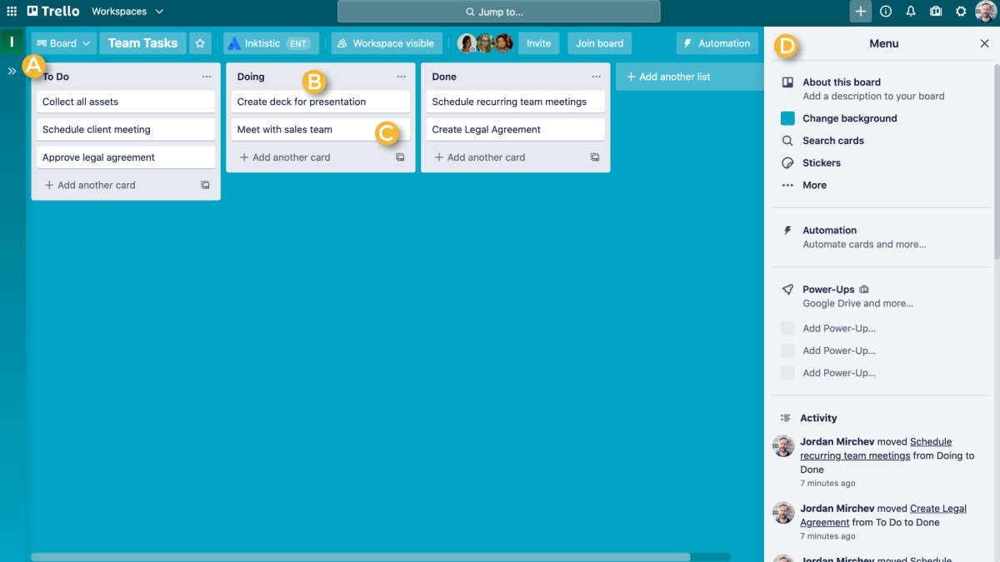

# Задача

Необходимо создать доску задач на примере Trello, задачи можно перемещать между собой внутри одной доски, так и с доски на доску через (Drag and Drop). 

Макет: 

Результат выполнения задания нужно поместить в github репозиторий.

Запуск проекта:

- npm i
- npm start