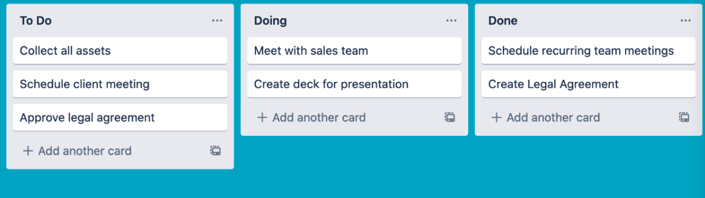

# Задача

Необходимо создать доску задач на примере Trello, задачи можно перемещать между собой внутри одной доски, так и с доски на доску через (Drag and Drop). 

Макет: 

- Доска представляет собой пространство, где можно следить за информацией.

- В колонках содержатся карточки, задания или иная информация, которые таким образом упорядочены по различным этапам прогресса. С помощью колонок можно создать рабочий процесс, при котором карточки будут продвигаться по каждому этапу процесса от начала до конца или же просто служить хранилищем идей и информации. На доску можно добавить любое количество колонок, а затем упорядочить и переименовать их по своему вкусу.

- Карточка - это самая маленькая, но при этом самая емкая часть доски. На карточках формулируются задания и идеи. Карточка описывает определенную задачу (например, сделать запись в блоге) или содержит информацию для запоминания.

Результат выполнения задания нужно поместить в github репозиторий.

Запуск проекта:

- npm i
- npm start